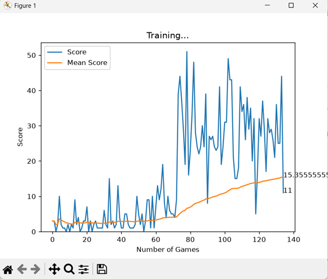

# Snake AI - Deep Q-Learning

A Snake game where an AI agent learns to play entirely through trial and error

## Results
The agent learns to chase food and avoid walls after ~80 games, with scores climbing steadily over time.



## How It Works
The agent uses a neural network to predict the best action (straight, right, left) given the current game state. The state is represented as 11 values:
- 3 danger values (is there a collision straight/right/left)
- 4 direction values (which way is the snake currently moving)
- 4 food direction values (where is the food relative to the head)

The network is trained using the Bellman equation — rewarding food (+10) and penalizing death (-10). Experience replay stores past game states and samples randomly from them to stabilize training.

## How To Run

**Install dependencies:**
```
pip install pygame torch numpy matplotlib ipython
```

**Train the agent:**
```
python agent.py
```

**Watch a trained game:**
```
python test_snake.py
```

## Project Structure
- `snake_game.py` — the Snake game environment
- `agent.py` — the DQN agent and training loop
- `model.py` — the neural network and trainer
- `plot.py` — live training graph
- `test_game.py` — watch the trained agent play

## Built With
- Python
- PyTorch
- Pygame
- Matplotlib
